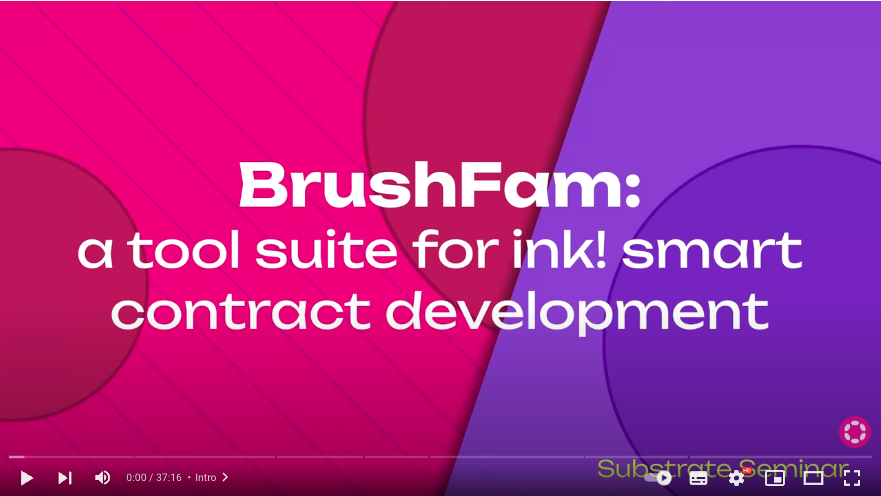

# Build a Voting Dapp tutorial

**Author**: Sacha Lansky

**Maintainers**: Sacha Lansky

**Source code**: https://github.com/sacha-l/voting-dApp-workshop

**Intended audience**: Beginners/Intermediate

**Topics**: ink!, OpenBrush, Governance

Welcome to the Polkadot voting dApp tutorial. In this tutorial, you’ll learn how to build a dApp in the [ink! programming language](https://use.ink/) using [OpenBrush](https://parity.link/BgsMh) - an ink! smart contract library and toolkit. 
This tutorial is based on the [Substrate Seminar](https://substrate.io/ecosystem/resources/seminar/) introducing [BrushFam](https://brushfam.io/) (see the full video below). It's recommended that you watch it before diving in.

You’ll learn the basics of creating a multi-contract dApp that implements staking and voting logic for a simple application to allow users to vote and propose items to be voted on. **The dApp you’ll be building is for educational purposes, meant to be fun, educational and extensible and not meant to be deployed to production.** 😊

<!-- slide:break -->

<!-- tabs:start -->

## What you'll learn

- Use and extend a PSP22 contract
- Implement Staking and Voting logic using OpenBrush's trait implementation pattern
- Create cross-contract calls

## Prerequisites

- Complete the [beginner’s ink! tutorial](https://docs.substrate.io/tutorials/smart-contracts/develop-a-smart-contract/) (this implies that you have Rust and Cargo Contract installed on your machine).
- Know basic Rust.
- Have a wallet browser extension to sign transactions. We recommend [Talisman](https://parity.link/cdiFF) or the [Polkadot JS extension](https://parity.link/B3LUZ).
- Have some ROC tokens to deploy your dApp. Get some from the [faucet here](https://parity.link/4e43J).

## Tools

The tools you’ll be exploring in this tutorial are: 

- [ink!](https://parity.link/Kb89s) - a DSL for writing Wasm smart contracts for Substrate chains.
- [OpenBrush](https://parity.link/BgsMh) - a smart contract library and framework for developing dApps.
- The [Contracts parachain](https://use.ink/testnet#what-is-the-contracts-parachain) on Rococo - a Polkadot-like live testnet.
- The [Contracts UI](https://contracts-ui.substrate.io/) - a UI to easily deploy contracts to [Rococo](https://substrate.io/developers/rococo-network/).

We recommend to use [Rust analyzer](https://rust-analyzer.github.io/) to help troubleshoot your code and make sure your code builds as you complete each section.

The tutorial assumes you’re using ink! version >= 4.1.0 and OpenBrush version >= 3.1.0

<!-- tabs:end -->